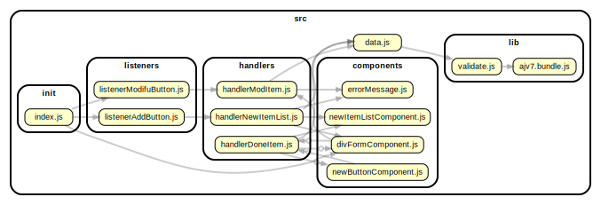

<!-- BEGIN TITLE -->

# DOCS

<!-- END TITLE -->

<!-- BEGIN TREE -->

<!-- END TREE -->

<!-- BEGIN TOC -->

- components
  - [divFormComponent.js](#srccomponentsdivFormComponentjs)
  - [errorMessage.js](#srccomponentserrorMessagejs)
  - [newItemListComponent.js](#srccomponentsnewItemListComponentjs)
- handlers
  - [handlerNewItemList.js](#srchandlershandlerNewItemListjs)
- init
  - [index.js](#srcinitindexjs)
- listeners
  - [listenerAddButton.js](#srclistenerslistenerAddButtonjs)
- logic
- procedures
- [data.js](#srcdatajs)

<!-- END TOC -->

<!-- BEGIN DOCS -->

---

# /components

<a href="../src/components/divFormComponent.js" id="srccomponentsdivFormComponentjs">src/components/divFormComponent.js</a>

<a href="../src/components/errorMessage.js" id="srccomponentserrorMessagejs">src/components/errorMessage.js</a>

<a href="../src/components/newItemListComponent.js" id="srccomponentsnewItemListComponentjs">src/components/newItemListComponent.js</a>

---

[TOP](#DOCS)

---

# /handlers

<a href="../src/handlers/handlerNewItemList.js" id="srchandlershandlerNewItemListjs">src/handlers/handlerNewItemList.js</a>

---

[TOP](#DOCS)

---

# /init

<a href="../src/init/index.js" id="srcinitindexjs">src/init/index.js</a>

---

[TOP](#DOCS)

---

# /listeners

<a href="../src/listeners/listenerAddButton.js" id="srclistenerslistenerAddButtonjs">src/listeners/listenerAddButton.js</a>

---

[TOP](#DOCS)

---

# /logic

---

[TOP](#DOCS)

---

# /procedures

---

[TOP](#DOCS)

<a href="../src/data.js" id="srcdatajs">src/data.js</a>

<!-- END DOCS -->
