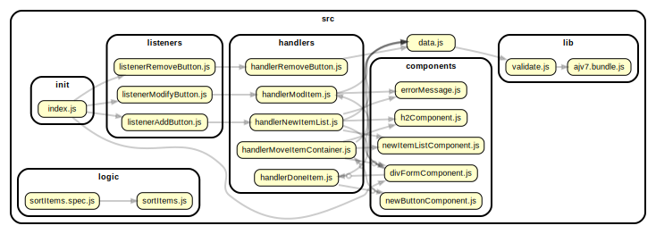

<!-- BEGIN TITLE -->

# DOCS

<!-- END TITLE -->

<!-- BEGIN TREE -->

<!-- END TREE -->

<!-- BEGIN TOC -->

- components
  - [divFormComponent.js](#srccomponentsdivFormComponentjs)
  - [errorMessage.js](#srccomponentserrorMessagejs)
  - [h2Component.js](#srccomponentsh2Componentjs)
  - [newButtonComponent.js](#srccomponentsnewButtonComponentjs)
  - [newItemListComponent.js](#srccomponentsnewItemListComponentjs)
- handlers
  - [handlerDoneItem.js](#srchandlershandlerDoneItemjs)
  - [handlerModItem.js](#srchandlershandlerModItemjs)
  - [handlerMoveItemContainer.js](#srchandlershandlerMoveItemContainerjs)
  - [handlerNewItemList.js](#srchandlershandlerNewItemListjs)
  - [handlerRemoveButton.js](#srchandlershandlerRemoveButtonjs)
- init
  - [index.js](#srcinitindexjs)
- lib
  - [ajv7.bundle.js](#srclibajv7bundlejs)
  - [validate.js](#srclibvalidatejs)
- listeners
  - [listenerAddButton.js](#srclistenerslistenerAddButtonjs)
  - [listenerModifyButton.js](#srclistenerslistenerModifyButtonjs)
  - [listenerRemoveButton.js](#srclistenerslistenerRemoveButtonjs)
- logic
  - [sortItems.js](#srclogicsortItemsjs)
- procedures
- [data.js](#srcdatajs)

<!-- END TOC -->

<!-- BEGIN DOCS -->

---

# /components

<a href="../src/components/divFormComponent.js" id="srccomponentsdivFormComponentjs">src/components/divFormComponent.js</a>

<a href="../src/components/errorMessage.js" id="srccomponentserrorMessagejs">src/components/errorMessage.js</a>

<a href="../src/components/h2Component.js" id="srccomponentsh2Componentjs">src/components/h2Component.js</a>

<a href="../src/components/newButtonComponent.js" id="srccomponentsnewButtonComponentjs">src/components/newButtonComponent.js</a>

<a href="../src/components/newItemListComponent.js" id="srccomponentsnewItemListComponentjs">src/components/newItemListComponent.js</a>

---

[TOP](#DOCS)

---

# /handlers

<a href="../src/handlers/handlerDoneItem.js" id="srchandlershandlerDoneItemjs">src/handlers/handlerDoneItem.js</a>

<a href="../src/handlers/handlerModItem.js" id="srchandlershandlerModItemjs">src/handlers/handlerModItem.js</a>

<a href="../src/handlers/handlerMoveItemContainer.js" id="srchandlershandlerMoveItemContainerjs">src/handlers/handlerMoveItemContainer.js</a>

<a href="../src/handlers/handlerNewItemList.js" id="srchandlershandlerNewItemListjs">src/handlers/handlerNewItemList.js</a>

<a href="../src/handlers/handlerRemoveButton.js" id="srchandlershandlerRemoveButtonjs">src/handlers/handlerRemoveButton.js</a>

---

[TOP](#DOCS)

---

# /init

<a href="../src/init/index.js" id="srcinitindexjs">src/init/index.js</a>

---

[TOP](#DOCS)

---

# /lib

<a href="../src/lib/ajv7.bundle.js" id="srclibajv7bundlejs">src/lib/ajv7.bundle.js</a>

<a href="../src/lib/validate.js" id="srclibvalidatejs">src/lib/validate.js</a>

---

[TOP](#DOCS)

---

# /listeners

<a href="../src/listeners/listenerAddButton.js" id="srclistenerslistenerAddButtonjs">src/listeners/listenerAddButton.js</a>

<a href="../src/listeners/listenerModifyButton.js" id="srclistenerslistenerModifyButtonjs">src/listeners/listenerModifyButton.js</a>

<a href="../src/listeners/listenerRemoveButton.js" id="srclistenerslistenerRemoveButtonjs">src/listeners/listenerRemoveButton.js</a>

---

[TOP](#DOCS)

---

# /logic

<a href="../src/logic/sortItems.js" id="srclogicsortItemsjs">src/logic/sortItems.js</a>

---

[TOP](#DOCS)

---

# /procedures

---

[TOP](#DOCS)

<a href="../src/data.js" id="srcdatajs">src/data.js</a>

<!-- END DOCS -->
